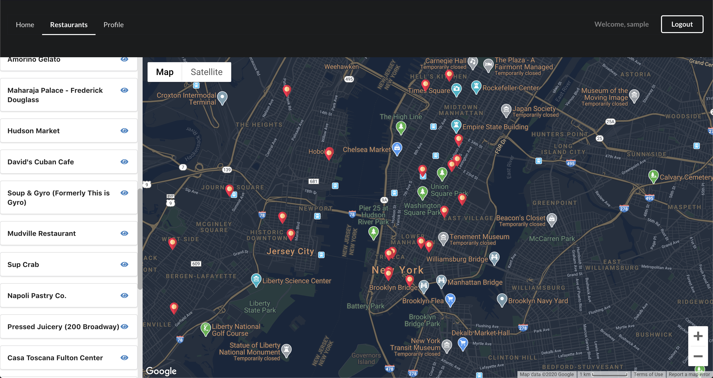

This project was bootstrapped with [Create React App](https://github.com/facebook/create-react-app).

# Welp Restaurant App 🍜
Welp is a full stack web application that allows the user to view restaurants around Jersey City and New York City through google maps and allowing the user to leave a review/rating for a specific restaurant.

* [Deployed Version](https://restaurant-client-react.herokuapp.com/home)
* [Video Demo](https://www.youtube.com/watch?v=1cgreYWLC1E)
* [Server-side Repo](https://github.com/reireynoso/restaurant_app_rails) 

* The API for the Welp, Restaurant App.
* The API consists of 5 domain models with `has_many` and `belongs_to` associations.
* Sample data was pulled from a network request in Grubhub.

# Getting Started
Before setting up, make sure the server is installed along with Node.js and NPM

## Prerequisites
If it is not installed, go in your terminal, and follow the steps:

1. Install the [server](https://github.com/reireynoso/restaurant_app_rails) 
2. Install [Node and NPM](https://www.npmjs.com/get-npm)

## Setup

From your terminal,

1. Clone the repo and `cd` into the folder
2. Install dependencies with `npm install`
3. Launch the server first with `rails s` and run the react application with `npm start`

# Features
- Built using pure functional components
- Viewing restaurants based on Location
- Reviewing restaurants
- Rating dishes
- User authentication/authorization
- Image upload for user
- User updating information including password

# Built With
* React
* Semantic UI 
* Ruby on Rails (API)

# Tools
* React-Redux (global state management)
* React-Router
* Google Maps React [tutorial](https://dev.to/jessicabetts/how-to-use-google-maps-api-and-react-js-26c2)
* Semantic UI
* Animate.css
* React Hooks 
* Cloudinary
* JSON Web Tokens
* Figaro (environment variables)

# Authors
Reinald Reynoso